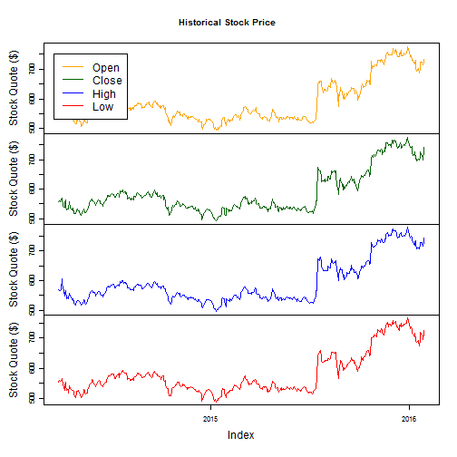

Display Historical Stock Quotes on demand using Shiny
========================================================
author: Sriram Chitturi
date: January 31, 2016

Parameters
========================================================

The following are the required inputs to display a stock quote

- Stock ticker (eg. C, AAPL, GOOG, K)
- Date range - Start and End dates

Say for our example, let us consider 
- Ticker = 'GOOG' (Google)
- Start date = 01/01/2016
- End date = 01/31/2016

Getting quotes at runtime from Yahoo Finance, an example
========================================================


```r
ticker <- "GOOG"
# to get data for some years in the past
url <- paste("http://ichart.finance.yahoo.com/table.csv?s=", ticker, "&c=1990", sep="");
dataX <- read.csv(url); dataX$Date = as.Date(dataX$Date);
head(dataX[, c("Date", "Open", "Close", "Low", "High")])
```

```
        Date   Open  Close     Low    High
1 2016-01-29 731.53 742.95 726.800 744.990
2 2016-01-28 722.22 730.96 712.350 733.690
3 2016-01-27 713.67 699.99 694.390 718.235
4 2016-01-26 713.85 713.04 706.480 718.280
5 2016-01-25 723.58 711.67 710.010 729.680
6 2016-01-22 723.60 725.25 720.121 728.130
```

Inputs in Shiny Application
========================================================

In my Shiny application I have used

- __textInput__ for Ticker
- __dateRangeInput__ to get Start and End dates the user is interested in

Also I was displaying only the Close (end of day) quotes.

So, provided 3
__checkBoxInputs__ to see if user is interested in displaying Open,High and Low quotes.

Chart display
========================================================


```r
library(xts)
# dataX <- read.csv("http://ichart.finance.yahoo.com/table.csv?s=GOOG&c=1990");
data.xts <- as.xts(dataX[, c("Open", "Close", "High", "Low")], dataX[,1])
zoo.basket <- as.zoo(data.xts); colors <- c("orange", "darkgreen", "blue", "red");
plot(x = zoo.basket, ylab = "Stock Quote ($)", main = "Historical Stock Price", col=colors);
legend(x = "topleft", legend = c("Open", "Close", "High", "Low"), lty = 1,col = colors);
```

 
